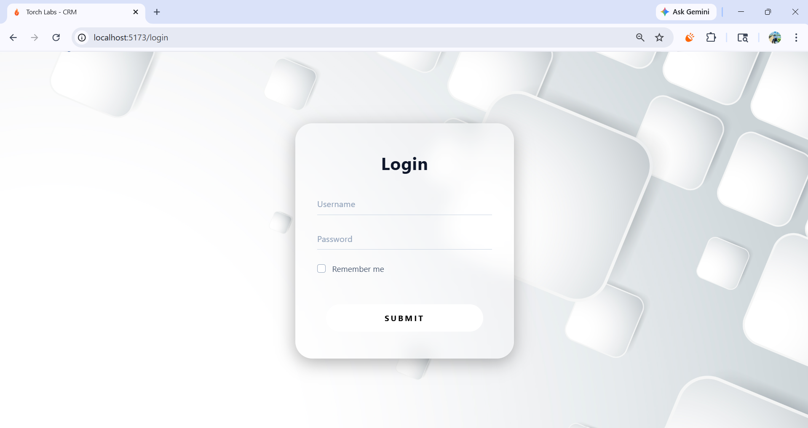
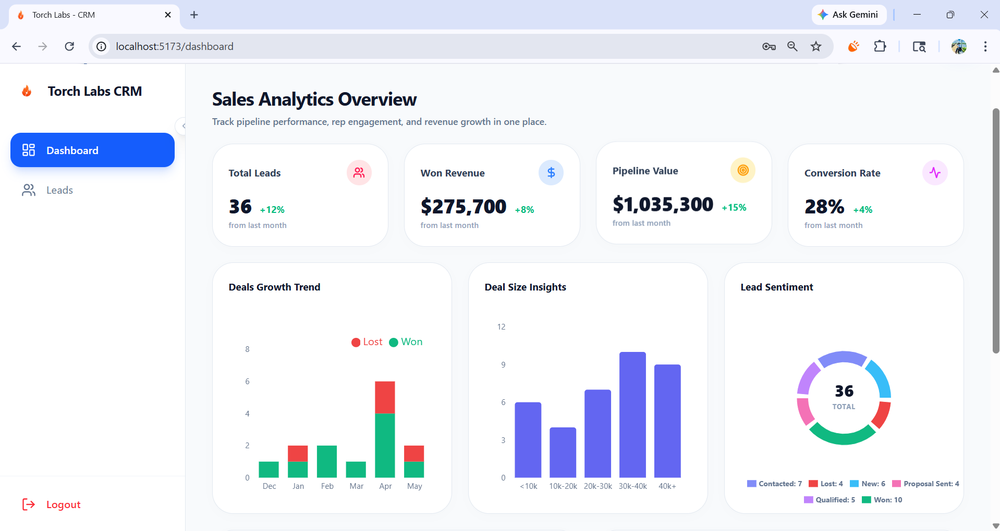
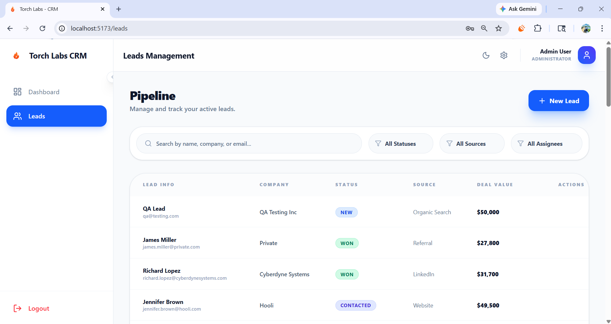
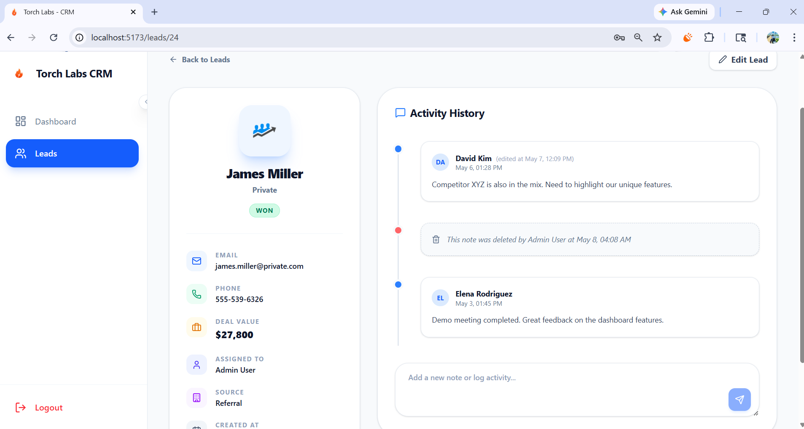

# CRM Lead Management System

A high-performance, production-ready CRM solution designed for sales teams to manage pipelines, track lead engagement, and visualize business growth. Built with a modern tech stack focused on speed, aesthetics, and user experience.

---

## Project Overview

The **Torch Labs CRM** is a comprehensive lead management platform that streamlines the sales process. From initial lead acquisition to final conversion, the system provides real-time visibility into the sales pipeline.

---

## 📸 Screenshots

| Login Page | Dashboard |
| :--- | :--- |
|  |  |

| Leads Management | Lead Details |
| :--- | :--- |
|  |  |

---

**Key Objectives:**
*   **Lead Lifecycle Management:** Centralized tracking of leads from "New" to "Won/Lost" statuses.
*   **Engagement Tracking:** Robust notes and activity timeline system for every lead.
*   **Data-Driven Insights:** Dynamic analytics dashboard for monitoring revenue, conversion rates, and rep performance.
*   **Sales Productivity:** Optimized UI for quick searching, filtering, and lead updates.

---

## Tech Stack

### Frontend
*   **React 18** - Component-based UI library.
*   **Tailwind CSS** - Modern utility-first styling.
*   **Framer Motion** - High-fidelity animations and transitions.
*   **Lucide React** - Premium iconography.
*   **React Router 6** - Client-side routing.
*   **Recharts** - Data visualization and analytics.

### Backend
*   **Node.js & Express** - Scalable server architecture.
*   **SQLite** - Local, file-based relational database.
*   **JWT (JSON Web Tokens)** - Secure authentication.
*   **Bcrypt.js** - Industry-standard password hashing.

---

## Features

### Authentication
*   **Secure Login:** JWT-based session management.
*   **Protected Routes:** Frontend and backend middleware to enforce authorization.
*   **Persistence:** Persistent login sessions across refreshes.

### Leads Management
*   **Full CRUD:** Create, View, Edit, and Delete leads seamlessly.
*   **Status Pipeline:** Visual badges for tracking lead progress (New, Contacted, Qualified, etc.).
*   **Advanced Filtering:** Filter by status, source, or search by name/email/company.

### Lead Notes & Activity
*   **Timeline View:** A chronological history of all interactions with a lead.
*   **Rich Interactions:** Add, Edit, and Delete notes.
*   **Audit Trail:** System tracks who created or edited notes.

### Analytics Dashboard
*   **KPI Cards:** Real-time stats for Pipeline Value, Revenue, Conversion, and Active Deals.
*   **Growth Trends:** Visualize lead acquisition over time.
*   **Performance Metrics:** Rep-by-rep performance tracking and win rates.
*   **Distribution Charts:** Breakdown by lead source and pipeline sentiment.

---

## Project Structure

### Frontend (`/frontend`)
```text
src/
├── api/            # Axios instance and API calls
├── assets/         # Static images and global styles
├── components/     # Reusable UI components (Dashboard, Layout, Leads)
├── context/        # Auth and Global State providers
├── pages/          # Full-page views (Login, Dashboard, Leads)
└── App.jsx         # Root component & Routing
```

### Backend (`/backend`)
```text
backend/
├── controllers/    # Business logic for routes
├── db/             # SQLite connection and Seed scripts
├── middleware/     # Auth and error handling middleware
├── routes/         # Express route definitions
└── server.js       # Entry point
```

---

## Installation & Setup

### 1. Clone the Repository
```bash
git clone https://github.com/sheda3838/crm-application.git
cd crm-application
```

### 2. Backend Setup
```bash
cd backend
npm install
# Create .env file based on .env.example
cp .env.example .env
# Start the server (Initializes and seeds SQLite db automatically)
npm run dev
```

### 3. Frontend Setup
```bash
cd ../frontend
npm install
# Create .env file based on .env.example
cp .env.example .env
# Start the development server
npm run dev
```

---

## Environment Variables

### Backend (`/backend/.env`)
*   `PORT`: Port for the Express server (default: 5000).
*   `JWT_SECRET`: Secret key for signing tokens.
*   `DATABASE_PATH`: Path to SQLite file (default: `./crm.db`).

### Frontend (`/frontend/.env`)
*   `VITE_API_URL`: Base URL for the backend API.

---

## Test Credentials

| Role | Email | Password |
| :--- | :--- | :--- |
| **Admin** | `admin@example.com` | `password123` |

---

## API Overview

| Endpoint | Method | Description |
| :--- | :--- | :--- |
| `/api/auth/login` | `POST` | Authenticate user and return JWT |
| `/api/dashboard` | `GET` | Fetch aggregated analytics data |
| `/api/leads` | `GET` | Fetch all leads (supports filtering) |
| `/api/leads/:id` | `GET` | Fetch detailed lead profile |
| `/api/leads/:id/notes` | `GET` | Fetch notes for a specific lead |

---

## Known Limitations & Future Roadmap

### Limitations
*   **SQLite:** Currently using a local file database (ideal for dev/staging, not high-scale production).
*   **Single Role:** Authorization logic is ready, but current seed only implements Admin-level access.

### Future Roadmap
*   **RBAC:** Role-Based Access Control for Managers vs. Sales Reps.
*   **Email Integration:** Send and track emails directly from the lead profile.
*   **Advanced Export:** Export pipeline data to CSV/Excel.
*   **Deployment:** CI/CD pipeline for Vercel (Frontend) and Render/Heroku (Backend).

---

## Reflection

This project was built to demonstrate the integration of modern frontend aesthetics with a robust Node.js backend. A major focus was placed on **responsiveness** and **data visualization**, ensuring that complex sales data remains digestible on any device. The choice of **SQLite** allowed for a zero-config setup for reviewers, while the **JWT architecture** ensures a secure foundation for future scaling.
